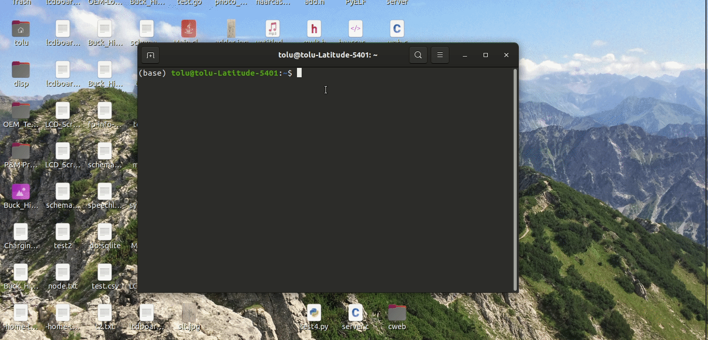

# DynamiChat Messaging Network Project Report

Tolulope Oshinowo

### Introduction:
The DynamiChat Messaging Network Project has been an ongoing initiative to create a chat messaging platform in which anyone from anywhere can communicate with another individual simply with their Unix Terminal. During the few weeks that this project was in development There were a multitude of both technical and design decisions that were needed to be made for the betterment of the platform.    

In this report these experiences will be discussed, along with major takeaways and a short manual on how to use DynamiChat. Before delving further however it is important to first take the time to understand what the leading motives behind Dynamichat were.

### DynamiChat Synopsis & Motives:
The ultimate goal of DynamiChat is to serve as a messaging platform that can be accessed simply from the user’s terminal with an internet connection, allowing for a more streamlined and simplistic medium of communication. As was stated in the project proposal and update, this project was taken underway to get a better understanding of how C can be used to create applications in online communications, but as it continued to grow more ambitious there was an additional objective to learn how to implement terminal aesthetics with C.

For the majority of this project's time in development not too many external sources were used in terms of DynamiChat’s implementation (outside of HeadFirstC or homework exercises), but as internet communications began to get implemented and additional aesthetics began to be sought after this would change. Starting with internet communications, a MongoDB Atlas cluster was set up to hold the data from messages sent and received, and DyanmiChat would communicate with this database using GET and POST requests written initially with Python (to test feasibility) and then with C with the MongoDB C Driver.

<sub><sup> *Snippet from `GET.c` using MongoDB's C driver's BSON to query the database.* </sub></sup>
```
filter = BCON_NEW ("message", BCON_REGEX("","s"));
opts = BCON_NEW ("limit", BCON_INT64 (1000));
cursor = mongoc_collection_find_with_opts (collection, filter, opts, NULL);
```  

<sub><sup> *Snippet from `POST.c` using MongoDB's C driver's BSON to post message to database.* </sub></sup>
```
client = mongoc_client_new ("mongodb+srv://<username>:<password>@dynamichat.h3mb4.mongodb.net/myFirstDatabase?retryWrites=true&w=majority");
collection = mongoc_client_get_collection (client, "chats", argv[1]);

doc = bson_new ();
bson_oid_init (&oid, NULL);
BSON_APPEND_OID (doc, "_id", &oid);
BSON_APPEND_UTF8 (doc, "username", argv[2]);
BSON_APPEND_UTF8 (doc, "datetime", argv[3]);
BSON_APPEND_UTF8 (doc, "message", argv[4]);

if (!mongoc_collection_insert_one (collection, doc, NULL, NULL, &error)) {
  fprintf(stderr, "%s\n", error.message);
}
```

The aesthetics already present were expanded upon with varying colors on the terminal for different strings, ncurses when possible, and clever usage of setting cursor positions and special layout characters to simulate ncurses when ncureses would not be compatible. but implementing ncurses is still a subject of interest.

<sub><sup> *Snippet from `dynamichat.c` using the Unix terminal's built-in functionality to simulate a GUI...* </sub></sup>
```
printf(GF
  "\n\n\n\n\n\n"
  "                                              ENTER YOUR SESSION USERNAME:\n" WF
  "                           ┌─────────────────────────────────────────────────────────────────┐\n"
  "                           │                                                                 │\n"
  "                           └─────────────────────────────────────────────────────────────────┘\n"
BF);
gotoxy(30, 9);
fgets(usr, 1024, stdin);
```

<sub><sup> *... and the snippets from `common.h` defining the escape codes being used.* </sub></sup>
```
#define GF   "\x1B[32m"
#define BF   "\x1B[34m"
#define gotoxy(x,y) printf("\033[%d;%dH", (y), (x))
```

Doing all of this would of course require the use of external sources, and the two greatest benefactors in these endeavors were the MongoDB C Driver and ncurses documentation pages. Links to these sources will be included at the bottom of this report.

### Deliverables:
In terms of deliverables, everything that was scoped to get completed for the allotted time was successfully implemented. In the initial proposal a basic file to file read-write application was set as the MVP, and that benchmark was achieved ahead of schedule. From there a stab was taken at making the application look aesthetically different from the terminal; that too was implemented relatively quickly.    

With this newfound scheduling buffer there was ample time to really research how to set up databases, use JSON/BSON, and send information between terminal windows. This made it so that the online implementation part of the project was smoother than expected, and so the `fprintf()` functions became `system()` calls to the compiled scripts to get data from and post data to the database. With the online implementation done there was just enough time to create an ncureses splash screen for DynamiChat and then have people beta-test the platform.

<sub><sup> *Snippet from `dynamichat.c` to system call a GET request on collection from within the database.* </sub></sup>
```
char getquery[64];
strcpy(getquery, "./GET ");
strcat(getquery, id);
system(getquery);
```

<sub><sup> *Snippet from `keyboard.c` to system call a POST request to collection from within the database with the username, datetime, and actual message text.* </sub></sup>
```
fgets(message, 1024, stdin);
char postquery[64];
if (strcmp(strtok(message,"\n"), "") != 0) {
  strcpy(postquery, "./POST ");
  strcat(postquery, id);
  strcat(postquery, " \"");
  strcat(postquery, usr);
  strcat(postquery, "\" \"");
  strcat(postquery, datetime);
  strcat(postquery, "\" \"");
  strcat(postquery, message);
  strcat(postquery, "\"");
  system(postquery);
}
```

### Design Decisions and Overall Reflection:
As was mentioned at the beginning of this report, there were certain technical and design decisions that were needed to be made in order for this project to come to fruition. One of these decisions was determining which type of database would best for this project. Due to the fact that DynamiChat was intended to be the opposite of cookie-cutter, it felt fitting to go with a No-SQL database. Knowing that MongoDB was a great platform with extensive documentation made it a clear winner for a place to host the database early on in the ideation process. Another decision that needed to be made was to figure out how the UI of DynamiChat should look like. For that inspiration was roughly drawn from text messaging UI's from the late 2000's. This planted the seed for a dual-window setup where one window would be for displaying messages in the chat while the other would be to send typed in content, alluding to the designs of phones like the Blackberry or Samsung Gravity.

Looking back on this project, it is safe to say that this project was in large part a success. Both learning goals were met and all tasks on the Trello Board were completed. Although it is indeed the case that the MVP and main objectives were fulfilled, the reach goal of implementing blockchain technology to store chats in a decentralized manner as opposed to a centralized database were not able to be achieved due to time constraints. This would-be idea remains alluring, and in many ways is a motive for a continuation of this project sometime in the future.

<sub><sup> *DynamiChat!* </sub></sup>



### Running Dynamichat:
To run DyanmiChat make sure that your Unix machine is up to date with the latest operating system and dependencies. Additionally make sure that the following tools are installed in order for the program to run properly:

xdotool: `sudo apt-get install -y xdotool`    
xterm: `sudo apt-get install -y xterm`  
ncurses: `sudo apt-get install libncurses5-dev libncursesw5-dev`   
gcc/g++/make: `sudo apt install build-essential`   
libmongoc/libbson: `apt-get install libmongoc-1.0-0`   

In the best case scenario DynamiChat should run out of the box given that the previous packages have been installed. To run simply type `./dynamichat` into the terminal from the root directory of this repository on your machine. In the event that the program still does not execute recompile all executables in the root directory. To do this simply type the following into your terminal.

`make dynamichat`    
`make keyboard`  
`make GET`    
`make POST`  

Once this is done retry `./dynamichat`. By now you should be able to execute DynamiChat and be greeted with the splash screen. Enter a username for yourself, and then type in a room code (you and a friend or a group can predetermine what you want you chat code to be). You should then have two terminal windows on your screen: one to view messages from and one to type with. Try sending a message. If it works they you are all set. If it does not however then you can look into the `/python` sub-directory for a contingency plan. If you do need to resort to that make sure that Python is installed on your system.

And there it is! You are now a DynamiChatter!
```
 _____                             _  _____ _             _
|  __ \_    _ ___  _____ ________ (_)/ ____| |__  _______| |_
| |  \ \\  / | _ \/  _  |  _   _ \| | /    |  _ \/  _  |_   _|
| |__/ / \/ / / \ | |_| | / \ / \ | | \____| / \ | |_| | | |_
|_____/ \  /|_| |_|__/\_|_| |_| |_|_|\_____|_| |_|__/\_| |___|
       _/ /
       \_/
```

## External Sources:
MongoDB C Driver Documentation: http://mongoc.org/   
ncurses Documentation: https://tldp.org/HOWTO/NCURSES-Programming-HOWTO/

## Project Links:
GitHub Repository: https://github.com/toluooshy/SoftSysDynamiChat    
Trello Board: https://trello.com/b/YbTsRhUA/dynamichat   
